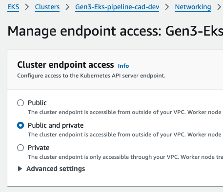

Quickstart Guide for Gen3 EKS Pipeline (Dev Environment)
========================================================

Prerequisites
-------------

Before starting the setup, ensure that the following parameters are stored in AWS Parameter Store and AWS Secrets Manager:

### Parameter Store Values

1.  **/gen3/config**

    Please note that `tools` account is required in the configuration, it can be the same AWS account as workload. This is where the pipeline is deployed.

        {
            "dev": {
                "name": "dev",
                "clusterName": "Gen3-Eks-pipeline-cad-dev",
                "aws": {
                    "account": "1234567890123",
                    "region": "ap-southeast-2"
                },
                "vpcId": "",
                "namespace": "cad",
                "workloadRepoUrl": "https://github.com/AustralianBioCommons/gen3-workloads-example.git",
                "targetRevision": "main"
            },
            "tools": {
                "name": "tools",
                "aws": {
                    "account": "1234567890123",
                    "region": "ap-southeast-2"
                },
                "vpcId": "",
                "namespace": "",
                "workloadRepoUrl": "",
                "targetRevision": ""
            }
        }

2.  **/gen3/dev/iamRolesConfig**

        {
        "portal": [
            {
                "Effect": "Allow",
                "Action": [
                    "s3:ListAllMyBuckets"
                ],
                "Resource": "*"
            }
        ],
        "metadata": [
            {
                "Effect": "Allow",
                "Action": [
                    "s3:ListAllMyBuckets"
                ],
                "Resource": "*"
            }
        ]
        }

3.  **/gen3/dev/cluster-config**

        {
            "version": "1.30",
            "minSize": 1,
            "maxSize": 2,
            "desiredSize": 2,
            "diskSize": 100,
            "amiReleaseVersion": "1.30.0-20240703",
            "instanceType": "m5.2xlarge",
            "tags": {
                "Name": "GEN3 Cluster",
                "Type": "ACDC",
                "ENV": "dev"
            }
        }

5.  **/gen3/eks-blueprint-repo**

        {
            "gitRepoOwner": "AustralianBioCommons",
            "repoUrl": "gen3-eks-pipeline",
            "targetRevision": "main"
        }

        replace gitRepoOwner with your org/user.

        
### Secrets Manager Values

1.  **ArgoCD Admin Password**

    -   Name: `argocdAdmin-dev`
    -   Type: String
    -   Value: (Set your desired password here)
2.  **GitHub Authentication**

    -   Either:
        -   **CodeStar Connection ARN**
            -   Name: `code-star-connection-arn`
            -   Value: (Set your CodeStar connection ARN here)
        -   **GitHub Token**
            -   Name: `github-token`
            -   Value: (Set your GitHub token with necessary permissions to the repository)

Steps to Set Up the Environment
-------------------------------

1.  **Clone the Repository**

    `git clone git@github.com:AustralianBioCommons/gen3-eks-pipeline.git
    cd gen3-eks-pipeline`

2.  **Install Dependencies** Make sure you have the AWS CDK and other dependencies installed. If not, run:

    `npm install`

3.  **Deploy the Stacks** Use the AWS CDK to deploy your stacks for the dev environment.

    `cdk deploy Gen3-Eks-pipeline-stack --require-approval never`
    
    `cdk deploy --all --require-approval never`

4.  **Access ArgoCD** After the deployment, access ArgoCD by the ELB DNS name

 Use the username `admin` and the password stored in Secrets Manager under `argocdAdmin-dev`.

5.  **Connect to Your Workload Repository** Ensure the `workloadRepoUrl` in the Parameter Store is correctly set to your GitHub repository, and that you have the necessary permissions configured for either the CodeStar connection or GitHub token.

6.  **Monitor Your Pipeline** After setting everything up, you can monitor your deployments through ArgoCD and ensure that your applications are successfully deployed.

7. **Kubeconfig Command** For using `kubectl` See outputs of the cloudformation stack named {env}-{env}-blueprint, for this guide it would be dev-dev-blueprint.

Accessing EKS Endpoints
------------------------------
By default, the EKS cluster is deployed with private endpoints, meaning `kubectl` access from the internet requires a VPN connection. However, for testing and demo purposes, you can manually enable public/private endpoints through the AWS Console. `Kubeconfig` details can be found in the Cloudformation stack outputs.

